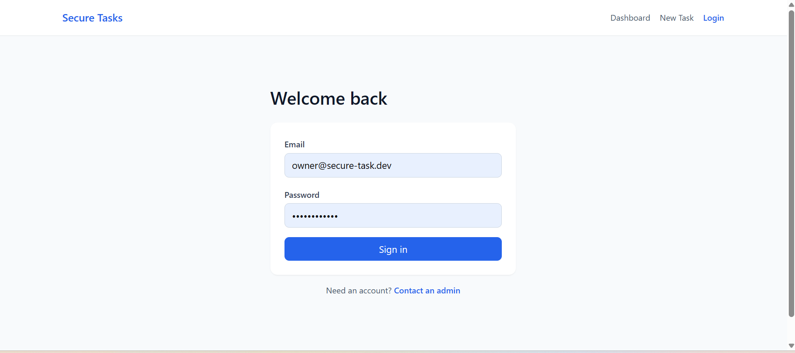
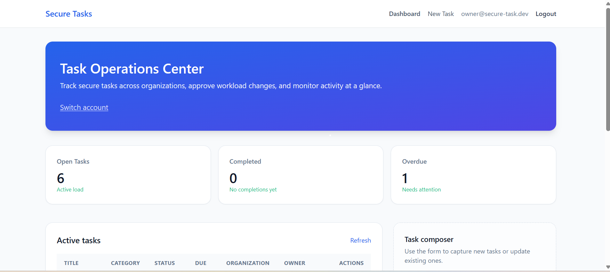
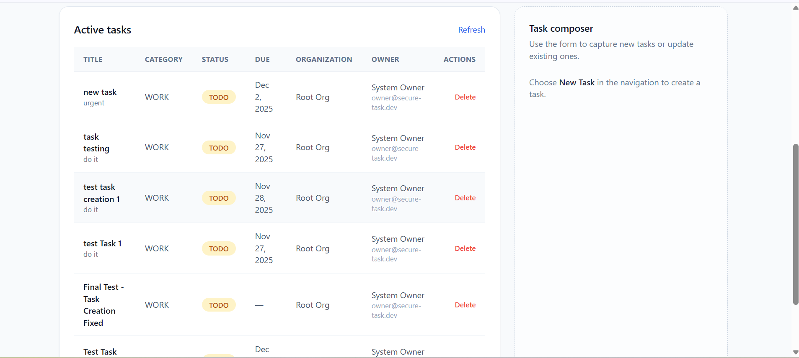

# Secure Task Management System

A comprehensive enterprise-grade task management application built with modern web technologies, featuring robust authentication, role-based access control, and secure task operations across organizational hierarchies.

## 🚀 Application Overview

The Secure Task Management System is a full-stack web application designed for organizations to manage tasks securely across different organizational levels. The system provides a centralized platform for task creation, monitoring, and management with enterprise-level security features.

### Key Highlights
- **Modern Architecture**: Built with NestJS backend and Angular frontend in an Nx monorepo
- **Enterprise Security**: JWT authentication with role-based access control (RBAC)
- **Organizational Hierarchy**: Support for multi-level organizational structures
- **Audit Logging**: Comprehensive activity tracking and audit trails
- **Professional UI**: Clean, responsive interface with modern design patterns
- **Database Integration**: SQLite with TypeORM for reliable data persistence

## 🛠️ Technology Stack

**Backend:**
- NestJS (Node.js framework)
- TypeORM (Database ORM)
- SQLite (Database)
- JWT (Authentication)
- Bcrypt (Password hashing)

**Frontend:**
- Angular 17+
- TypeScript
- Tailwind CSS
- RxJS

**Development:**
- Nx Monorepo
- Webpack
- ESLint & Prettier

## 📋 Prerequisites

Before running the application, ensure you have the following installed:
- Node.js (v18 or higher)
- npm (v8 or higher)

## 🚀 How to Run the Application

Follow these steps to run the Secure Task Management System:

### Step 1: Navigate to Project Directory
```bash
cd "c:\Users\ADITI\OneDrive\Desktop\Secure Task Management System\secure-task-mgmt"
```

### Step 2: Install Dependencies
```bash
npm install
```

### Step 3: Build and Run API Server (Terminal 1)
```bash
npx nx build api
node dist/api/main.js
```

### Step 4: Run Frontend Application (Terminal 2)
Open a new terminal and run:
```bash
npx nx serve dashboard
```

### Step 5: Access the Application
- **Frontend URL**: http://localhost:4200
- **API URL**: http://localhost:3000/api

## 🔐 Login Credentials

Use the following credentials to access the system:

**Default Owner Account:**
- **Email**: `owner@secure-task.dev`
- **Password**: `ChangeMe123!`

## 📱 Application Features & User Journey

### 1. Login Screen


**Features:**
- Secure authentication with email and password
- Form validation and error handling
- "Contact an admin" link for account requests
- Professional welcome message

### 2. Dashboard - Task Operations Center


**Features:**
- **Task Statistics Overview**: Real-time display of task metrics
  - Open Tasks count with status indicator
  - Completed tasks tracking
  - Overdue tasks with attention alerts
- **User Information**: Display of logged-in user details
- **Navigation Menu**: Easy access to all application features
- **Task Operations Center**: Central hub for task management

### 3. Active Tasks Management


**Features:**
- **Task Table**: Comprehensive view of all active tasks
  - Task title and description
  - Category classification (Work, Personal, etc.)
  - Status tracking (TODO, IN_PROGRESS, DONE)
  - Due date management
  - Organization assignment
  - Owner information
- **Task Actions**: 
  - Delete functionality for task removal
  - Refresh capability for real-time updates
- **Task Composer**: Integrated form for task creation

### 4. Task Creation
**Features:**
- **Form-based Task Creation**: Intuitive interface for new task entry
- **Field Validation**: Ensures data integrity
- **Category Selection**: Organized task classification
- **Status Management**: Initial status assignment
- **Due Date Setting**: Optional deadline configuration

### 5. Security & Access Control
**Features:**
- **Role-Based Access Control (RBAC)**:
  - **Owner**: Full system access across all organizations
  - **Admin**: Organization-level management capabilities
  - **Viewer**: Read-only access to assigned tasks
- **JWT Authentication**: Secure token-based session management
- **Audit Logging**: Complete activity tracking for compliance
- **Organization Hierarchy**: Multi-level organizational support

### 6. System Administration
**Features:**
- **User Management**: Account creation and role assignment
- **Organization Management**: Hierarchical organization structure
- **Database Seeding**: Automatic setup of default users and organizations
- **Security Monitoring**: Comprehensive audit trail

## 🔧 System Architecture

### Backend Architecture
- **Modular Design**: Organized into feature modules (Auth, Tasks, Users, Organizations)
- **Database Layer**: TypeORM entities with proper relationships
- **Security Layer**: JWT guards and RBAC decorators
- **Service Layer**: Business logic separation
- **Controller Layer**: API endpoint management

### Frontend Architecture
- **Component-Based**: Angular standalone components
- **Service Layer**: API communication and state management
- **Routing**: Angular Router with guards
- **Styling**: Tailwind CSS for responsive design
- **Type Safety**: Full TypeScript implementation

## 📊 Database Schema

The application uses a well-structured database schema with the following key entities:
- **Users**: User accounts with role assignments
- **Organizations**: Hierarchical organization structure
- **Tasks**: Task management with full lifecycle tracking
- **Audit Logs**: Complete activity tracking

## 🔒 Security Features

1. **Authentication**: JWT-based secure authentication
2. **Authorization**: Role-based access control (RBAC)
3. **Password Security**: Bcrypt hashing for password storage
4. **Input Validation**: Comprehensive data validation
5. **Audit Logging**: Complete activity tracking
6. **Session Management**: Secure token handling

## 🎯 Application Flow

1. **Login**: User authenticates with email/password
2. **Dashboard**: View task statistics and system overview
3. **Task Management**: Create, view, and delete tasks
4. **Navigation**: Seamless movement between features
5. **Logout**: Secure session termination

## 📈 Performance & Stability

The application has been optimized for stability and performance:
- **Production Build**: Optimized API server build process
- **Error Handling**: Comprehensive error management
- **Loading States**: User-friendly loading indicators
- **Responsive Design**: Works across all device sizes

## 🚀 Deployment Ready

The application is designed for easy deployment with:
- **Environment Configuration**: Flexible environment settings
- **Build Optimization**: Production-ready builds
- **Database Migration**: Automatic schema setup
- **Health Checks**: System monitoring capabilities

## 📝 Notes

- The edit functionality has been temporarily disabled for system stability
- All core features (authentication, dashboard, task creation, task deletion) are fully functional
- The system uses SQLite for development but can be easily configured for production databases
- Comprehensive audit logging ensures full traceability of all system activities

---

**Assessment Submission**: This application demonstrates a complete, enterprise-grade task management system with modern architecture, robust security, and professional user experience.
